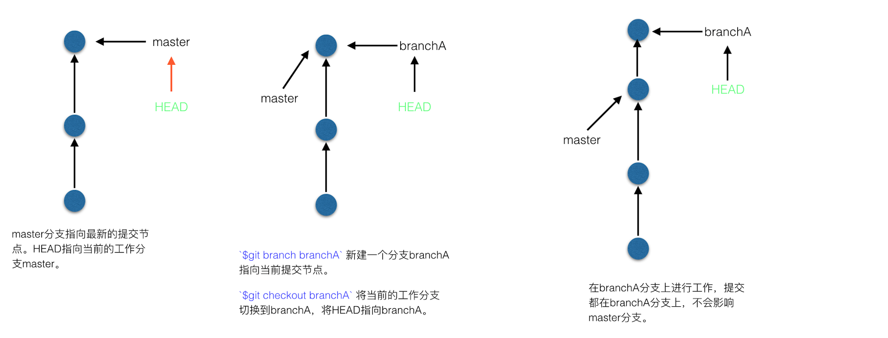
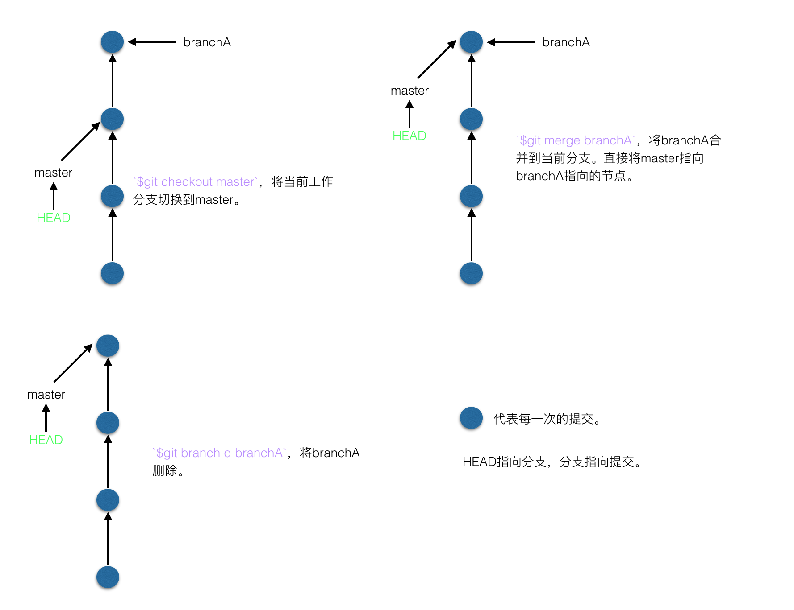

# Git的基本介绍和使用

继续学习：  
[关于 Git 你需要知道的一些事情](http://www.codeceo.com/article/about-git.html)

###### ...是什么？

目前为止世界上最好用的分布式版本控制系统，没有之一。  
（在Mac下git中文乱码的解决办法，在终端是执行 `git config --global core.quotepath false`命令即可）

##### ...和SVN等集中式版本控制系统的区别

###### ...什么是分布式 什么是集中式

| 集中式 | 分布式 |
| --- | --- |
| 版本库集中放在中央服务器上，工作的时候先从中央服务区获取最新的版本，做完以后要将自己的修改提交到中央服务器上。 | 没有中央服务器，每个人的电脑上都是一个完整的版本库。在正常工作中，分布式版本控制系统通常也会有一个“中央服务器”，但这个服务器的作用仅仅是用来方便交换大家的修改的，没有它也可以正常工作，只不过麻烦一点要每个人都相互交换。 |

###### ...当中央服务器挂掉并无法修复的时候

| 集中式 | 分布式 |
| --- | --- |
| 新建一个服务器，然后将某位电脑上保存有的新工程提交上去，虽然保证了一份最新的工程，但也只是有这个最新的工程罢了，所有的历史版本将无法找回，这样的版本控制系统就有了断片，之前的所有版本都永远无法找回。 | 新建一个中央服务器，由于每个人的电脑上都有一份完整的版本库，所以将任何一位的版本库提交的新的中央服务器，就可以继续愉快的工作了。 |

###### ...断网的时候

| 集中式 | 分布式 |
| --- | --- |
| 每个人还可以正常的在自己的本地版本上工作，但是没法更新，没法提交，最主要的是没法做版本控制工作。 | 由于每个人的电脑上都有一份完整的版本库，所以都可以做正常的版本控制工作，还能提交的本地的版本库，只需要在有网的时候将本地的版本库push到中央服务器就行了 |

##### ...工作区和暂缓区

Git和其他版本控制器如SVN的不同之处在与Git有暂缓区的概念。  
==工作区==：就是工程在电脑上所对应文件夹。  
==版本库==：工作区中有一个隐藏文件夹.git，这个不算是工作区，而是Git的版本库；  
Git版本库里面的东西很多，其中最重要的是暂缓区\(stage/index\)，还有git为我们创建的一个分支master，以及指向master的指针叫做HEAD。


我们在工作区每次修改，先通过git add命令添加到暂缓区，最后再通过git commit命令将暂缓区的所有修改一次性提交到本地的master分支上。

##### ...Git工作流程

一般在工作区的操作大致上就是这三种，下面一一根据 工作区变化-&gt;提交到stage-&gt;提交到master-&gt;push到远程仓库 几个步骤来分析：  
 1、在工作区修改、添加或删除文件，此时的`git status`提示：

```
On branch master
// 暂缓区stage中没有要提交的内容
Changes not staged for commit:
// 使用git add／rm 文件名 命令将文件add到暂缓区stage
(use "git add/rm <file>..." to update what will be committed)
// 使用git checkout -- 文件名 命令撤销在工作区的修改
(use "git checkout -- <file>..." to discard changes in working
```

2、当执行完`git add/rm 文件名`使文件到达暂缓区的时候，此时执行`git status`提示：

```
On branch master
// 暂缓区中有要提交的内容
Changes to be committed:
// 使用git reset HEAD 文件名 将文件从暂缓区stage移出回本地工作区
  (use "git reset HEAD <file>..." to unstage)
```

3、当执行完`git commit -m "提交备注"`将文件从暂缓区提交到`master`分支后，执行`git status`提示：

```
On branch master
// master中有一个提交
Your branch is ahead of 'origin/master' by 1 commit.
// 使用git push将本地仓库推到远程仓库中
  (use "git push" to publish your local commits)
nothing to commit, working tree clean
```

已经提交到本地master但没有push到远程仓库的时候，可以通过`git reset --hard commit_id`命令来进行版本回退撤销本次commit的内容。其中`commit_id`为需要退回到的版本id，可以使用`git log`（不包含回退掉的提交log）`git log --pretty=oneline`\(一行展示log信息\)`git reflog`\(包含回退掉的所有提交log\)来查看commit log并获取到想要的版本id.

4、当修改已经`git push`到中央服务器的时候，虽然仍可撤销再提交，但别人已经能够看到撤销之前的版本。首先完成上一个步骤即本地`master`分支回退，然后使用`git push -h`强制推送覆盖远程分支。[远程仓库版本回退方法](http://blog.csdn.net/fuchaosz/article/details/52170105)

###### ...常用命令

`git add/rm 文件名` 添加修改／删除修改到暂缓区  
`git commit -m "提交log"` 将暂缓区的内容提交到本地仓库   
`git push` 将本地`master`分支的内容提交到远程仓库  
`git checkout -- 文件名` 撤销工作区的修改  
`git reset HEAD 文件名`  将文件从暂缓区移出回本地工作区  
`git reset --hard commit_id` 版本回退，回退到指定版本id对应的版本

```
// 查看log信息的几个命令：
git log
git log --pretty=oneline
git reflog
```

##### ...分支管理

###### ....为什么要创建多个分支?

为了能够在不更改影响主分支的情况下仍然在多人团队之间进行开发、版本控制工作。  
默认情况下只有一个主分支master，可以通过新建分支的方式创建出一个主分支master的‘备份’内容，两个分支之间的版本控制是相互独立互不干扰的。最后可以通过分支合并的方式将新分支中的内容合并到master分支中。  
在当前master分支上新建一个dev分支，在dev分支上进行修改提交后提交到哪里了？提交的分支上了，如果不合并就强制删除分支的话，master分支上是不会包含dev分支上修改后的内容。

###### ...多分支开发合并的工作原理

  
  
新建分支branchA -&gt; 切换到分支branchA -&gt; 在新分支branchA上进行工作 -&gt; 结束工作后进行提交 -&gt; 提交后进行合并 -&gt; 合并后删除branchA

###### ...命令

查看当前的分支情况：`git branch` 当前正在使用的分支名称前会加`*`号  
分支的创建：`git branch 分支名称`  
分支切换：`git checkout 要切换到的分支名称`  
分支创建+分支切换：`git checkout -b 分支名称`  
分支合并：`git merge 分支A`将分支A合并到当前的分支上  
删除分支：`git branch -d 要删除的分支名称`  
强制删除未合并的分支：`git branch -D 要删除的分支名称`

###### ...git stash

当在A分支上进行工作的时候，突然需要紧急解决一些问题，或者做一些紧急工作，而这个工作需要在新分支B上来进行工作。这时候如果立即新建并切换到分支B的话就会将A分支上还未完成的工作带到分支B上，这样分支B就会被‘污染’，而A分支上的工作由于只进行到一半还不想提交。  
这时候可以使用`git stash`命令，先讲A分支上的改动储存起来，完事后执行`git status`可以看到，A分支‘干净了’，没有一丝改动，这样就可以安心的创建并切换分支B了。分支B上的工作结束并提交后，切换到分支A，并将分支B合并到分支A，删除分支B，接着使用`git status pop`命令取出先前存储起来的修改内容。

###### ...多分支Question & Answer

_**Question**_ dev上push到哪里了 有没有push到远程仓库？  
_**Answer**_ 有 但是push到的是远程dev分支，而master push到的是远程的master分支。

_**Question**_ 如果远程向远程仓库中推了一个原本不存在的分支会怎样？  
_**Answer**_ 如下，会提示在远程仓库中没有这个分支，如果需要的话可以执行`git push --set-upstream origin 新分支名`来在远程仓库中创建这个分支。

```
fatal: The current branch test has no upstream branch.
To push the current branch and set the remote as upstream, use

    git push --set-upstream origin test
```

###### ...多人协作

通过远程仓库来满足多人协作需求，大家通过远程仓库来保持通过。

* 查看远程仓库信息 使用`git remote -v`；
* 本地新建的分支如果不推送到远程，对其他人是不可见的；
* 从本地推送分支，使用`git push origin branchName`，如果推送失败，先用`git pull`抓取远程的新提交；
* 在本地创建和远程分支对应的分支，使用`git checkout -b branchName origin/branchName`，本地和远程分支名称最好一样；
* 建立本地分支和远程分支的关联，使用`git branch --set-upstream branchName origin/branchName`；
* 从远程抓取分支，使用`git pull`，如果有冲突，先解决冲突。

###### ...忽略文件

在与.git文件同级的文件夹中新建.gitignore文件，在.gitignore文件中添加要忽略的文件。  
文件是否忽略的原则：  
1. 操作系统自动生成的文件。如：.DS\_Store文件；  
2. 编译器自动生成的中间文件、可执行文件。即一个文件是通过另一个文件自动生成的。如：iOS中根据podfile文件获取到的第三方库。  
3. 自己不想提交的文件。如：含有敏感信息的文件。

已经提交的版本库中的文件是不能够在忽略的，需要先从版本库中删除掉，才能忽略。

.gitignore的常用规则：

* \*.md 过滤掉所有md类型的文件；  
* A文件 过滤掉A文件，包含A文件下的所有文件；  
* A文件/B文件 过滤掉A文件下的B文件；  
* !A文件/C文件 前面加一个感叹号，表示除了A文件下的C文件，其他的全都忽略掉；  


